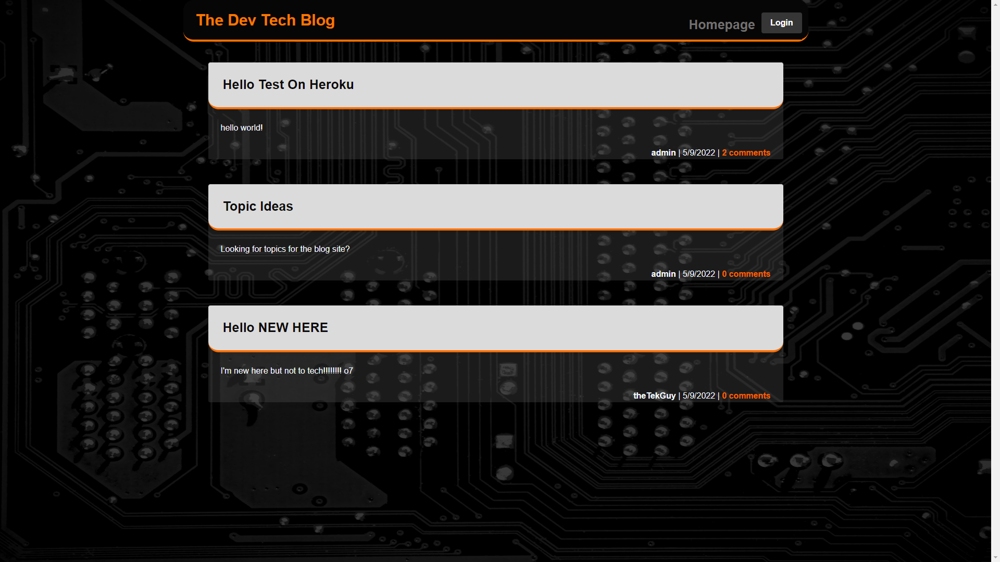

# The Dev Tech Blog

## License

## Table of Contents
- [Project Description](#project-description)  
- [Installation Information](#installation-information)  
- [Usage Information](#usage-information)  
- [Test Instructions](#test-instructions)  
- [Contributors on this Project](#contributors-on-this-project)  
- [Contact Information](#contact-information)  
  
## Project Description
- This Tech Blog application requires a User to create a login to enable to ability to create, update and delete the users blog contents.
- This app uses the following technoligies:
- Heroku / JawsDB (Database)
- MySQL
- Javascript
  - Node.js
  - connect-session-sequelize
  - express-session
  - handlebars
  - dotenv
  - bcrypt
  - express
  - sequelize

  
## Installation Information
- None
  
## Usage Information
- Check out The Dev Tech Blog here in the live link.
- https://the-devtech-blog.herokuapp.com/ 
- 

## Contributors on this Project
- None at this time.
- *[Contribution Guidlines](https://github.com/github/docs/blob/main/CONTRIBUTING.md)*
  
## Test Instructions
- Go to the live link and create a user account.

## Questions

- If you have any questions about the repo, open an issue or contact me on Github or by Email.
### Contact Information
- Github [RHoward1](https://github.com/RHoward1)
  - Email at ryanmhoward.dev@gmail.com

## License Statement
- This application is covered by the  license.
- Visit [MIT](https://opensource.org/licenses/MIT) for more information.
